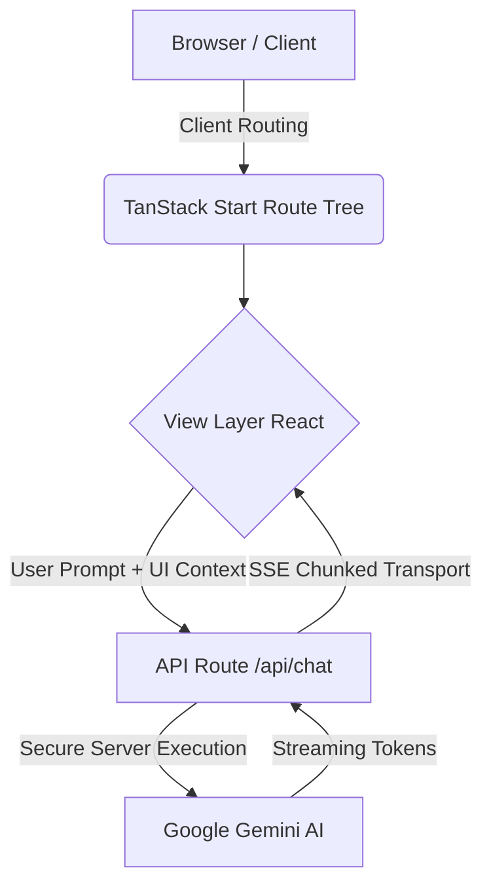

# 🗳️ Election Process Education Platform

[](https://reactjs.org/)
[](https://tanstack.com/router/latest)
[](https://ai.google.dev/)
[](https://leafletjs.com/)
[](https://opensource.org/licenses/MIT)

A lightweight, robust, and highly accessible civic-tech web platform designed to educate first-time voters about the Indian election process. Built with modern web technologies, the platform provides an interactive learning experience powered by AI, real-time mapping, and strict accessibility standards.

---

## 📑 Table of Contents

1. [Project Title & Overview](#1-project-title--overview)
2. [Problem Statement](#2-problem-statement)
3. [Solution](#3-solution)
4. [Key Features](#4-key-features)
5. [System Workflow](#5-system-workflow)
6. [System Architecture](#6-system-architecture)
7. [Tech Stack](#7-tech-stack)
8. [Folder Structure](#8-folder-structure)
9. [Detailed Module Explanations](#9-detailed-module-explanations)
10. [Security Architecture](#10-security-architecture)
11. [Accessibility Features](#11-accessibility-features)
12. [Performance Optimizations](#12-performance-optimizations)
13. [Deployment Guide](#13-deployment-guide)
14. [Future Enhancements](#14-future-enhancements)
15. [License](#15-mit-license)
16. [Contributors & Credits](#16-contributors--credits)
17. [Final Vision Statement](#17-final-vision-statement)

---

## 1. Project Title & Overview

**Election Process Education Platform**  
_Empowering citizens. Demystifying democracy._

This platform serves as a unified digital mentor for first-time voters and citizens seeking clarity on the voting process. By combining gamified learning paths (Quest Mode), structured encyclopedic data (Classic Mode), and an AI-driven "Voting Oracle," the platform transforms dense, bureaucratic election constraints into an engaging, empathetic, and highly accessible user experience.

---

## 2. Submission Details & Criteria

- **Chosen Vertical:** Civic Tech / EdTech
- **Target Audience:** First-time voters and citizens looking to understand the Indian electoral process.

### Approach and Logic
The platform's core logic is to lower the barrier to civic participation by transforming dense, intimidating bureaucratic rules into a progressive, interactive experience. We approached this by mapping out the entire voting lifecycle (from eligibility to the polling booth) and creating visual, gamified milestones. For dynamic edge cases, we integrated an AI Oracle (Gemini 2.0 Flash) that provides context-aware, non-partisan guidance without storing PII.

### How the Solution Works
The application uses a TanStack Start (React 18) frontend integrated with Node.js edge handlers. The UI uses gamified elements (like the Document Match drag-and-drop game and EVM Simulator) to teach concepts safely. When a user queries the Voting Oracle, the UI state (their current step) is injected into the AI prompt securely on the server-side (`/api/chat`), which then streams back instructions via Server-Sent Events (SSE). We utilize the native Web Speech API for TTS and Google Maps SDK for polling location visualization. Real-time behavior is tracked using Google Analytics 4 (GA4).

### Assumptions Made
1. **Target Region:** The terminology and simulations (EVM, Aadhaar/EPIC documents, VVPAT) assume the context of the Indian Electoral System.
2. **Browser Capabilities:** Assumes users are on modern browsers that support Web Speech API for TTS and CSS Grid/Flexbox.
3. **Accessibility Needs:** We assume users may have varying degrees of technical literacy and vision capabilities, hence the inclusion of high-contrast modes and global screen-reader compliance.
4. **Internet Connectivity:** Assumes users have an active internet connection to communicate with the Gemini AI endpoints and Google Maps.

---

## 3. Problem Statement

Participating in the democratic process can be incredibly daunting for new voters:

- **Voter Confusion:** Complex bureaucratic requirements regarding ID verification, registration deadlines, and polling booth procedures often discourage participation.
- **Accessibility Barriers:** Official election portals frequently lack robust localized accessibility features like Text-To-Speech (TTS), high-contrast viewing, and screen-readable workflows.
- **Information Overload:** Legacy systems present information in dense text blocks rather than progressive, interactive, and contextual steps.
- **Civic Engagement Gaps:** First-time voters lack private, non-judgmental spaces to ask "silly" questions (e.g., "What if I press the wrong button on the EVM?").

---

## 4. Solution

We solve this through a **progressive, AI-assisted learning platform**:

- **Gamified Mentorship:** A visual "Quest Mode" breaks down the voting timeline into digestible milestones.
- **AI-Powered Guidance:** The Voting Oracle (powered by Google Gemini) acts as a non-partisan, context-aware co-pilot, answering user queries instantly.
- **Accessibility-First Design:** Featuring zero-configuration Text-to-Speech (TTS), meticulous keyboard-navigation styling, and highly legible typography.
- **Interactive Simulations:** Providing safe, digital sandboxes for document matching and EVM (Electronic Voting Machine) practice.

---

## 4. Key Features

- 🤖 **Gemini AI Chatbot (The Voting Oracle):** A floating, context-aware assistant embedded globally across the platform.
- ⚡ **Real-Time Streaming Responses:** Server-Sent Events (SSE) provide a typewriter-like, instantaneous perception of AI intelligence.
- 🔊 **Text-to-Speech (TTS):** Utilizing the native Web Speech API to provide audio narration for steps, instructions, and AI responses.
- 🗺️ **OpenStreetMap Polling Visualization:** Privacy-first, API-key-free map integration via Leaflet and OSM to visualize polling stations.
- 🚦 **Dual Learning Modes:** Choose between "Quest Mode" (Gamified progressive disclosure) and "Classic Mode" (List-based encyclopedic view).
- 🛡️ **SSR-Safe Architecture:** Component lifecycle hooks flawlessly handle Server-Side Rendering (SSR) environments.
- 📱 **Mobile-First Responsiveness:** Fully fluid layouts built with Tailwind CSS that adapt gracefully to devices of all sizes.

---

## 5. System Workflow

### User Journey Flow

`Landing Page` ➔ `Select Mode (Quest/Classic)` ➔ `Interact with Timeline` ➔ `Consult Voting Oracle` ➔ `Explore Interactivity (EVM/ID Check/Map)`.

### Contextual Intelligence Flow

1. User interacts with a specific step (e.g., Registration).
2. The UI aggregates the active context (`expandedStep`, `progressRatio`).
3. User opens the _Voting Oracle_ and types a question.
4. The system injects the UI context into a hidden `systemContext` prompt.
5. The Gemini model responds organically, explicitly referencing the user's current progress in the UI.

---

## 6. System Architecture

The application implements a robust Client-Server hybrid utilizing **TanStack Start** for file-based routing and SSR optimization.



- **Frontend:** React 18+, TanStack Router, Tailwind CSS, Framer Motion.
- **Backend Integration:** Node.js Edge handlers (`/routes/api/*`) executing trusted server logic.
- **Map Integration:** React-Leaflet wrapped in a dynamic `import()` to protect SSR boundaries and minimize Initial Load.

---

## 7. Tech Stack

| Category                  | Technologies                              |
| :------------------------ | :---------------------------------------- |
| **Frontend Framework**    | React 18, TanStack Start                  |
| **Styling & Animation**   | Tailwind CSS, Framer Motion, Lucide Icons |
| **AI / Machine Learning** | Google Gemini (`@google/genai`)           |
| **Mapping & Geospatial**  | Leaflet, React-Leaflet, OpenStreetMap     |
| **Content Parsing**       | React-Markdown                            |
| **Accessibility**         | Native Web Speech API (TTS), ARIA         |
| **Tooling & Language**    | TypeScript, Vite, ESLint                  |

---

## 8. Folder Structure

```text
/src
 ├── api/                 # Server-side functions & controllers
 ├── components/          # React components
 │    ├── ui/             # Generic, atomic UI elements (buttons, badges)
 │    ├── ChatBubble.tsx  # The Voting Oracle logic & SSE streaming
 │    ├── PollingMap.tsx  # Lazy-loading map wrapper
 │    ├── PollingMapClient.tsx # Actual Leaflet implementation
 │    └── ...             # Feature components (QuestScreen, EvmPractice)
 ├── hooks/               # Custom React hooks (useStepDetails)
 ├── lib/                 # Utility libraries (audio.ts for TTS)
 ├── routes/              # TanStack Start file-based routing
 │    ├── api/            # API Endpoints (e.g., chat.ts)
 │    ├── __root.tsx      # Root application layout & Error Boundaries
 │    └── index.tsx       # Main Application Landing Page
 ├── styles.css           # Global Tailwind imports
 └── main.tsx             # Application Bootstrap
```

---

## 9. Detailed Module Explanations

- **`ChatBubble.tsx` & `/api/chat.ts`**: Implements the _Voting Oracle_. Uses `fetch` to stream Server-Sent Events (SSE). Incorporates an `AbortController` bound to the component lifecycle to prevent memory leaks if the user closes the chat mid-generation. Captures contextual UI state.
- **`PollingMap.tsx` & `PollingMapClient.tsx`**: Renders polling booth locations. Because Leaflet manipulates the DOM heavily, `PollingMap` dynamically imports `PollingMapClient` exclusively on the client-side (`useEffect`), bypassing SSR hydration errors completely.
- **`QuestScreen.tsx` / `ProgressCore.tsx`**: Manages the progressive disclosure of election steps. Calculates a real-time `progressRatio` used by both the UI progress bar and the AI context injector.
- **`SpeakButton.tsx` & `lib/audio.ts`**: The TTS engine. Contains singleton management for the `window.speechSynthesis` API, ensuring voices do not overlap. Flushes audio queues defensively when dismounting.

---

## 10. Security Architecture

- **Backend-only AI Security**: `GEMINI_API_KEY` is completely hidden from the client browser. All AI prompts are marshaled through the `api/chat.ts` secure server route.
- **Environment Verification**: Prevents initialization errors by checking process states gracefully and falling back to error boundaries rather than raw crashes.
- **Markdown Sanitization**: `react-markdown` dynamically overwrites the `<a>` element to forcibly inject `target="_blank" rel="noopener noreferrer"`, mitigating reverse-tabnabbing vulnerabilities from AI-generated links.
- **SSE Safety**: Streaming controllers are wrapped in `try/catch/finally` blocks prioritizing the `Signal.aborted` status to gracefully disconnect HTTP streams without throwing fatal Node.js server errors.
- **Client/Server Separation**: Strict module isolation (e.g., dynamic imports for map SDKs) ensures Node environments never attempt to evaluate `window` or `document` variables, providing SSR safety.

---

## 11. Accessibility Features

- 🔊 **Narrative UI (TTS)**: One-click "Read Aloud" features for every substantial text block, ensuring comprehension for users with visual impairments or reading difficulties.
- ⌨️ **Keyboard Navigation**: Core elements implement precise `focus-visible` ring indicators. The visual outline is highly distinguishable.
- 👁️ **Screen Reader Integration**: Extensive use of `aria-label`, `aria-hidden` (to hide decorative animated SVGs and pulse effects), and semantic HTML (`<main>`, `<header>`).
- 🌗 **High Contrast Optimization**: Palette adheres to modern WCAG contrast requirements, avoiding muted grays on white backgrounds for critical instructions.

---

## 12. Performance Optimizations

- **Memoization Strategy**: `React.memo`, `useMemo`, and `useCallback` are meticulously applied across the `ChatBubble` and `QuestScreen` to ensure keystrokes in the chat input do not re-render the heavy map or timeline components.
- **Map Lazy Loading**: `PollingMapClient` bundles Leaflet separately. The browser does not download map rendering code until the Map component mounts.
- **Defensive Cleanup**: Real-time listeners (`onSnapshot`, `speechSynthesis`, `map.on`) are universally cleaned up in `useEffect` return functions.
- **Stream Optimization**: The SSE consumer (`streamChat`) buffers incoming HTTP chunks by newline (`\n`), cleanly separating JSON payloads and preventing partial-parse crashes.

---

## 13. Deployment Guide

### Local Setup

1. **Clone & Install:**
   ```bash
   git clone <repository-url>
   cd election-education
   npm install
   ```
2. **Environment Variables:**
   Create a `.env` file referencing `.env.example`:
   ```env
   GEMINI_API_KEY="your_google_gemini_key_here"
   ```
3. **Run Development Server:**
   ```bash
   npm run dev
   ```
   _The application will boot at `http://localhost:3000`._

### Production Build

1. Build the TanStack Start boundaries:
   ```bash
   npm run build
   ```
2. Start the optimized node server:
   ```bash
   npm start
   ```

_Deployable across Vercel, Google Cloud Run, or any standard Node.js/Docker hosting environments._

---

## 14. Future Enhancements

- 🌍 **Multilingual Architecture:** Integration with Gemini API's native translating capabilities to provide civic data in Hindi, Tamil, Telugu, Bengali, and more.
- 📊 **Constituency Analytics:** Data visualization showing historical voter turnout and demographic details utilizing `d3` or `recharts`.
- 🔔 **Election Push Notifications:** Web Push implementations reminding registered users of their specific local polling dates.
- 📉 **Offline Accessibility Mode:** PWA (Progressive Web App) service workers caching the "Classic Mode" encyclopedia constraints so users can view ID requirements at polling booths with poor network connectivity.

---

## 15. MIT License

Copyright (c) 2026

Permission is hereby granted, free of charge, to any person obtaining a copy of this software and associated documentation files (the "Software"), to deal in the Software without restriction, including without limitation the rights to use, copy, modify, merge, publish, distribute, sublicense, and/or sell copies of the Software, and to permit persons to whom the Software is furnished to do so, subject to the following conditions:

The above copyright notice and this permission notice shall be included in all copies or substantial portions of the Software.

THE SOFTWARE IS PROVIDED "AS IS", WITHOUT WARRANTY OF ANY KIND, EXPRESS OR IMPLIED, INCLUDING BUT NOT LIMITED TO THE WARRANTIES OF MERCHANTABILITY, FITNESS FOR A PARTICULAR PURPOSE AND NONINFRINGEMENT. IN NO EVENT SHALL THE AUTHORS OR COPYRIGHT HOLDERS BE LIABLE FOR ANY CLAIM, DAMAGES OR OTHER LIABILITY, WHETHER IN AN ACTION OF CONTRACT, TORT OR OTHERWISE, ARISING FROM, OUT OF OR IN CONNECTION WITH THE SOFTWARE OR THE USE OR OTHER DEALINGS IN THE SOFTWARE.

---

## 16. Contributors & Credits

- **Core Platform Concept:** Built to empower the modern democratic electorate.
- **AI Backbone:** [Google Gemini](https://ai.google.dev/)
- **Mapping Infrastructure:** [OpenStreetMap](https://www.openstreetmap.org/) & [Leaflet](https://leafletjs.com/)
- **Frontend Ecosystem:** [TanStack Start](https://tanstack.com/router) & [Tailwind CSS](https://tailwindcss.com/)

---

## 17. Final Vision Statement

_"Democracy thrives when participation is accessible. By dismantling bureaucratic confusion through AI-driven insights, interactive simulations, and uncompromising accessibility, we transform first-time voters from hesitant observers into confident civic participants."_
